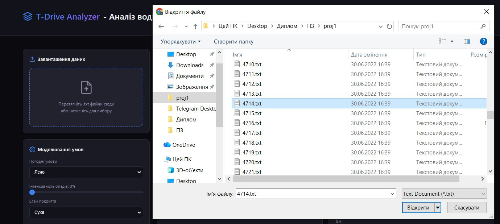
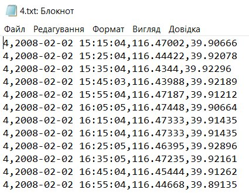
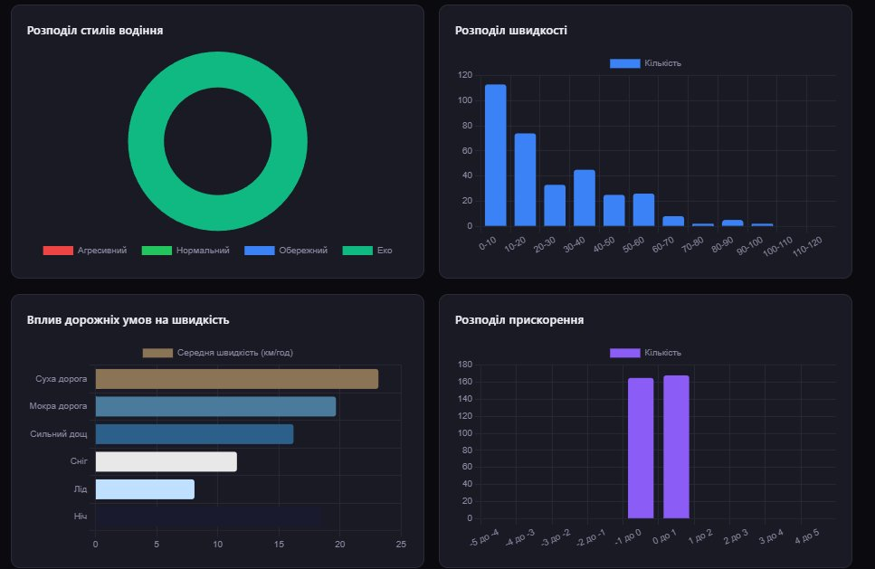
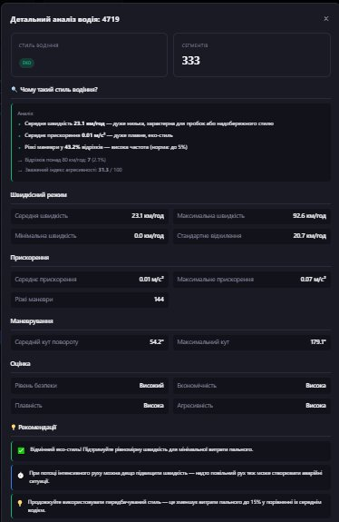
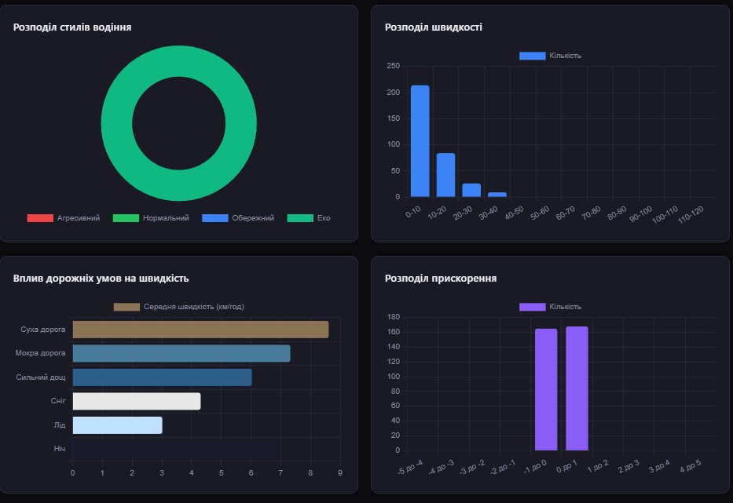
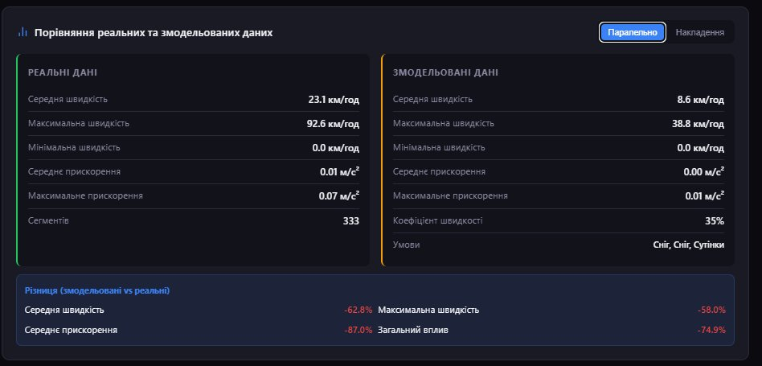
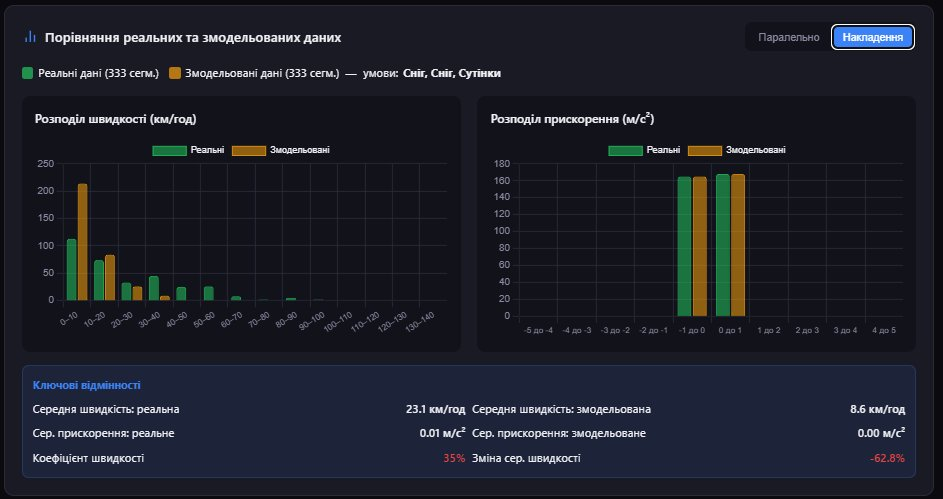
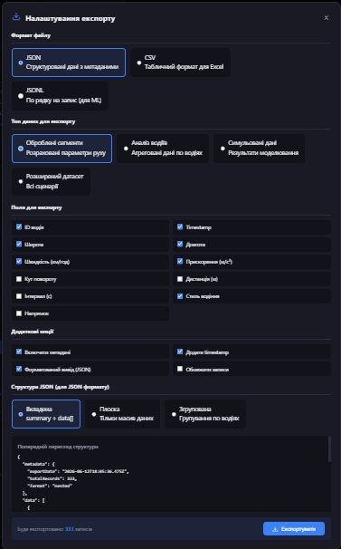

# Опис роботи користувача із системою

Інструкція користувача до вебзастосунку **T-Drive Analyzer** — програмного забезпечення для розширення транспортних даних шляхом моделювання дорожніх умов.

Застосунок повністю у середовищі браузера виконує завантаження реальних GPS-треків формату T-Drive, обчислення кінематичних параметрів руху, класифікацію стилів водіння, симуляцію впливу дорожньо-кліматичних умов, а також генерацію та експорт розширеного синтетичного датасету.

---

## Зміст

- [5.1 Системні вимоги та запуск](#51-системні-вимоги-та-запуск)
- [5.2 Завантаження даних](#52-завантаження-даних)
- [5.3 Перегляд статистики та графіків](#53-перегляд-статистики-та-графіків)
- [5.4 Симуляція дорожніх умов](#54-симуляція-дорожніх-умов)
- [5.5 Порівняння реальних та симульованих даних](#55-порівняння-реальних-та-симульованих-даних)
- [5.6 Генерація та експорт розширеного датасету](#56-генерація-та-експорт-розширеного-датасету)
- [Типовий сценарій роботи (швидкий старт)](#типовий-сценарій-роботи-швидкий-старт)
- [Перелік рисунків](#перелік-рисунків)

---

## 5.1 Системні вимоги та запуск

Застосунок реалізовано як вебдодаток, що працює локально у браузері. Для роботи достатньо сучасного веббраузера з підтримкою стандарту ECMAScript 2020 та увімкненим виконанням JavaScript — Google Chrome версії 90 і новіших, Mozilla Firefox версії 88 і новіших, Microsoft Edge або іншого браузера на основі рушія Chromium. Уся обробка даних відбувається в оперативній пам'яті браузера, тому вхідні файли не передаються на сторонні сервери, що гарантує конфіденційність даних.

Апаратні вимоги визначаються переважно обсягом вхідного датасету. Для комфортної роботи з файлами обсягом до кількох сотень тисяч GPS-точок достатньо персонального комп'ютера або ноутбука з 4 ГБ оперативної пам'яті та двоядерним процесором; для обробки великих наборів даних рекомендовано 8 ГБ оперативної пам'яті та більше. Окремого графічного прискорювача не потрібно, оскільки візуалізація засобами Chart.js ефективно працює на інтегрованій графіці.

Запуск зводиться до відкриття файла `traffic_simulator.html` у браузері подвійним клацанням. Підключення до мережі Інтернет потрібне лише під час першого відкриття сторінки для завантаження бібліотеки Chart.js з CDN; після кешування бібліотеки браузером застосунок працює автономно. Усі параметри симуляції задаються безпосередньо в інтерфейсі та не вимагають редагування конфігураційних файлів.

---

## 5.2 Завантаження даних

Робота із застосунком розпочинається із завантаження вхідних даних формату **T-Drive**. Користувач може скористатися одним із двох рівноцінних способів: натиснути на зону завантаження та обрати один чи кілька `.txt`-файлів у системному діалозі або перетягнути файли безпосередньо у цю зону за допомогою механізму drag-and-drop. Інтерфейс панелі завантаження наведено на рисунку 5.1.

**Рисунок 5.1 — Панель завантаження даних**

Під час вибору файлів у системному діалозі користувач указує один або кілька текстових файлів датасету (рисунок 5.2). Обидва способи завантаження передають дані в єдиний конвеєр обробки.

**Рисунок 5.2 — Вибір файлів датасету у системному діалозі**

Кожен рядок вхідного файла містить чотири поля, розділені комами, у порядку: **ідентифікатор таксі**, **часова мітка** (у форматі `РРРР-ММ-ДД ГГ:ХХ:СС`), **довгота**, **широта**. Приклад вмісту коректного вхідного файла наведено на рисунку 5.3.

**Рисунок 5.3 — Приклад вмісту вхідного файла формату T-Drive**

Після завантаження файлів застосунок автоматично виконує парсинг даних, обчислення кінематичних параметрів (відстань, швидкість, прискорення, кут повороту) та класифікацію стилів водіння. Панель «Журнал» у нижній частині інтерфейсу відображає хід обробки: кількість успішно зчитаних точок, кількість виявлених водіїв і сегментів траєкторій, а також підсумковий звіт. Некоректні рядки (заголовки, порожні чи пошкоджені записи) ігноруються без переривання обробки. Якщо користувач завантажує додаткові файли після початкового завантаження, нові дані додаються до вже наявних, формуючи об'єднаний датасет без втрати попередньо обробленої інформації.

---

## 5.3 Перегляд статистики та графіків

Після успішного завантаження та первинної обробки даних центральна область інтерфейсу перетворюється на багаторівневу панель аналітичної візуалізації. У верхньому рядку відображаються шість карток зведеної статистики: кількість GPS-точок, кількість водіїв, середня та максимальна швидкість, середнє прискорення та кількість сегментів руху.

Вкладка «Графіки» містить чотири інтерактивні діаграми, кожна з яких вирішує специфічне завдання інтерпретації даних: кільцева діаграма розподілу стилів водіння (агресивний, нормальний, обережний, еко), гістограма розподілу швидкості, горизонтальна діаграма впливу дорожніх умов на швидкість та гістограма розподілу прискорення. Приклад візуалізації наведено на рисунку 5.4.

**Рисунок 5.4 — Перегляд графіків та статистики**

Вкладка «Аналіз водіїв» містить інтерактивну таблицю зі зведеною статистикою по кожному учаснику руху: ідентифікатор водія, домінуючий стиль, середня та максимальна швидкість, середнє прискорення, кількість різких маневрів та кількість сегментів. Поле пошуку фільтрує таблицю в реальному часі за ідентифікатором водія, а вибір окремих водіїв прапорцями дозволяє видаляти аномальні записи з підтвердженням. Натискання кнопки «Деталі» у рядку таблиці відкриває модальне вікно з поглибленою статистикою обраного водія: повним набором кінематичних метрик, профілями швидкості й прискорення, поясненням віднесення до певного стилю та персональними рекомендаціями (рисунок 5.5).

**Рисунок 5.5 — Модальне вікно детальної статистики водія**

Таке деталізоване подання дозволяє перейти від узагальненої картини всього датасету до аналізу поведінки конкретного учасника руху. Закриття модального вікна повертає користувача до загальної панелі без втрати поточного стану таблиці, що забезпечує зручну ітеративну роботу.

---

## 5.4 Симуляція дорожніх умов

Панель «Моделювання умов» є ключовим модулем застосунку, призначеним для моделювання впливу зовнішніх дорожньо-кліматичних умов на кінематичні характеристики транспортних засобів у межах наявного датасету. Інтерфейс побудовано за принципом покрокового вибору параметрів (рисунок 5.6): погодні умови (один із семи сценаріїв — «Ясно», «Хмарно», «Туман», «Дощ», «Сильний дощ», «Сніг», «Заметіль»), інтенсивність опадів (повзунок 0–100 %), стан покриття (один із шести варіантів — «Сухе», «Мокре», «Калюжі», «Засніжене», «Ожеледь», «Чорний лід»), рівень трафіку (повзунок 0–100 %), видимість (повзунок 10–100 %) та час доби («День», «Світанок», «Сутінки», «Ніч»).

**Рисунок 5.6 — Панель моделювання умов**

Кожен параметр активує відповідний набір коефіцієнтів, що імітують фізичні обмеження руху (зменшення тертя, інерції, дальності огляду та збільшення часу реакції). Моделювання є адаптивним: коефіцієнти автоматично коригуються відповідно до профілю завантаженого датасету, про що сигналізує відповідний індикатор на панелі. Після налаштування параметрів натискання кнопки «Запустити симуляцію» перераховує кінематичні показники.

Візуальний зворотний зв'язок реалізовано через автоматичне оновлення графіків у режимі реального часу: діаграми розподілу швидкості та прискорення миттєво відображають результат застосування обраних умов. Приклад оновлених графіків після симуляції наведено на рисунку 5.7 — порівняно з базовим станом (рисунок 5.4) розподіл швидкостей зміщується у бік нижчих значень, а середня швидкість по дорожніх умовах помітно знижується.

**Рисунок 5.7 — Оновлення графіків у режимі реального часу**

Завдяки миттєвому перерахунку дослідник отримує безперервний інтерактивний зв'язок між заданими параметрами та результуючим розподілом кінематичних характеристик, що дозволяє в режимі експерименту підбирати поєднання умов і одразу спостерігати їхній сукупний ефект.

---

## 5.5 Порівняння реальних та симульованих даних

Вкладка «Порівняння» стає інформативною після успішного завершення симуляції. Цей модуль призначено для валідації якості згенерованих синтетичних даних шляхом їх зіставлення з оригінальними реальними вимірюваннями.

Режим «Паралельно» організує простір відображення у вигляді двох симетричних колонок: ліва містить агреговані числові показники реального датасету, права — відповідні метрики симульованого набору. Між колонками розташовано блок відхилень, що автоматично обчислює різницю у відсотковому й абсолютному вираженні (рисунок 5.8). У наведеному прикладі для умов «Сніг + Сутінки» середня швидкість симульованого набору знизилася на 62,8 % порівняно з реальним, що відповідає коефіцієнту швидкості 35 %.

**Рисунок 5.8 — Порівняння реальних та симульованих даних (режим «Паралельно»)**

Режим «Накладення» забезпечує глибший візуальний аналіз шляхом накладення двох наборів даних на спільні графічні осі, де реальні дані представлено зеленим кольором, а симульовані — помаранчевим (рисунок 5.9). Таке подання дозволяє миттєво оцінити зсув піків розподілу, зміну дисперсії та появу нових режимів руху.

**Рисунок 5.9 — Порівняння реальних та симульованих даних (режим «Накладення»)**

Незначні відхилення на окремих ділянках перебувають у межах статистичної похибки та не впливають на придатність датасету для навчання класифікаторів стилю водіння. Така візуалізація підтверджує коректність реалізованих алгоритмів симуляції та надає зручний інструмент для швидкої оцінки якості згенерованих даних.

---

## 5.6 Генерація та експорт розширеного датасету

Для отримання фінального розширеного датасету передбачено окрему панель «Дії» (рисунок 5.10) із двома елементами керування. Кнопка «Генерувати розширений датасет» запускає автоматичне формування масиву, у якому до всіх реальних сегментів послідовно застосовуються вісім наперед визначених погодно-дорожніх сценаріїв: «Ідеальні умови», «Дощ вдень», «Злива в сутінках», «Сніг вдень», «Заметіль вночі», «Туман на світанку», «Ясна ніч» та «Чорний лід». У такий спосіб обсяг вихідної вибірки багаторазово збільшується, а кожен запис збагачується контекстними ознаками зовнішніх умов (`weather`, `surface`, `timeOfDay`) та нормованими ознаками швидкості й прискорення.

**Рисунок 5.10 — Панель дій: генерація та експорт датасету**

Кнопка «Налаштувати експорт» відкриває модальне вікно гнучкого експорту (рисунок 5.11), у якому користувач задає формат файла (`JSON` — структуровані дані з метаданими, `CSV` — табличний формат для Excel, `JSONL` — по рядку на запис для конвеєрів машинного навчання), тип даних для експорту (оброблені сегменти, агрегований аналіз водіїв, симульовані дані або повний розширений датасет), перелік полів, додаткові опції (включення метаданих, додавання часової мітки, форматований вивід JSON, обмеження кількості записів) та структуру JSON (вкладена, плоска або згрупована за водіями). Область попереднього перегляду одразу відображає структуру майбутнього файла та підсумкову кількість записів.

**Рисунок 5.11 — Модальне вікно налаштування експорту датасету**

Сформований датасет доступний для завантаження у двох універсальних форматах. Під час збереження система автоматично генерує унікальне ім'я файла з міткою часу у форматі `РРРРММДД_ГГХХСС`, що спрощує керування версіями експериментів. Окремо вкладка «Детальні результати» надає текстовий звіт із розгорнутими секціями: загальна статистика, аналіз стилів водіння, аналіз швидкісного режиму, аналіз прискорення та гальмування, аналіз маневрування та порівняння з еталонними показниками.

---

## Типовий сценарій роботи (швидкий старт)

1. Відкрийте файл `traffic_simulator.html` у браузері.
2. Завантажте один або кілька `.txt`-файлів формату T-Drive (клацанням або перетягуванням).
3. Перегляньте зведену статистику та діаграми на вкладці «Графіки».
4. За потреби відкрийте «Аналіз водіїв» та натисніть «Деталі» для поглибленого аналізу конкретного водія.
5. Задайте умови на панелі «Моделювання умов» і натисніть «Запустити симуляцію».
6. Звірте результати на вкладці «Порівняння» у режимі «Паралельно» або «Накладення».
7. Сформуйте розширений набір кнопкою «Генерувати розширений датасет» та збережіть його через «Налаштувати експорт» у форматі JSON, CSV або JSONL.

---

## Перелік рисунків

| Рисунок | Файл |
| --- | --- |
| Рисунок 5.1 — Панель завантаження даних | `screenshots/fig-5.1-upload-panel.png` |
| Рисунок 5.2 — Вибір файлів датасету у системному діалозі | `screenshots/fig-5.2-file-dialog.png` |
| Рисунок 5.3 — Приклад вмісту вхідного файла формату T-Drive | `screenshots/fig-5.3-file-content.png` |
| Рисунок 5.4 — Перегляд графіків та статистики | `screenshots/fig-5.4-charts.png` |
| Рисунок 5.5 — Модальне вікно детальної статистики водія | `screenshots/fig-5.5-driver-modal.png` |
| Рисунок 5.6 — Панель моделювання умов | `screenshots/fig-5.6-simulation-panel.png` |
| Рисунок 5.7 — Оновлення графіків у режимі реального часу | `screenshots/fig-5.7-realtime-charts.png` |
| Рисунок 5.8 — Порівняння реальних та симульованих даних (режим «Паралельно») | `screenshots/fig-5.8-comparison-parallel.png` |
| Рисунок 5.9 — Порівняння реальних та симульованих даних (режим «Накладення») | `screenshots/fig-5.9-comparison-overlay.png` |
| Рисунок 5.10 — Панель дій: генерація та експорт датасету | `screenshots/fig-5.10-actions-panel.png` |
| Рисунок 5.11 — Модальне вікно налаштування експорту датасету | `screenshots/fig-5.11-export-modal.png` |
